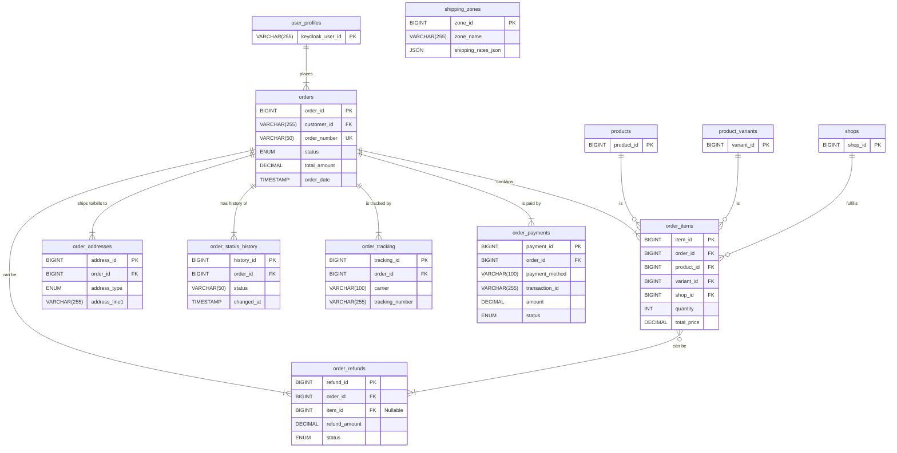

1. User Profile Management System ER-Diagram

2. Multi-Vendor Shop Management System ER-Diagram

3. Comprehensive Product Management System ER-Diagram

4. Comprehensive Order Management System ER-Diagram

5. Financial Transaction & Commission System ER-Diagram

6. Comprehensive Review and Rating System ER-Diagram

7. Coupon and Discount Management System ER-Diagram

8. Analytics and Reporting System ER-Diagram

9. Notification System ER-Diagram

10. Audit Logging and Security Monitoring System ER-Diagram
